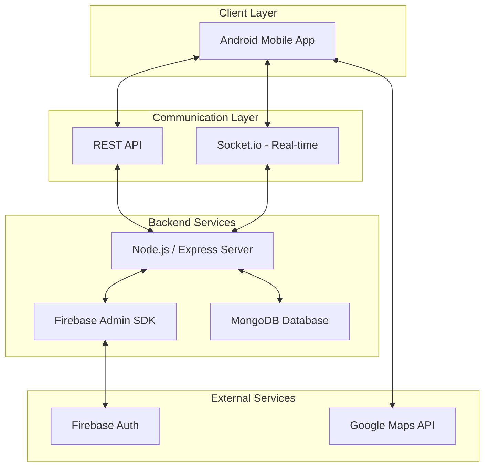

# Zenith Foods — Smart Delivery Ecosystem

Zenith Foods is a professional, full-stack mobile computing solution designed for modern food delivery services. It features real-time location tracking, dynamic delivery pricing, and a robust cloud-integrated backend.

## 🏛 Architecture Diagram



## 🚀 Key Features

- **Real-time Tracking**: Uses WebSockets (Socket.io) to track delivery partner/customer locations live on the map.
- **Dynamic Pricing**: Implements the **Haversine Formula** to calculate precise distances between the shop and the customer for accurate delivery charges.
- **Secure Authentication**: Integrated with Firebase Authentication for seamless and secure user login/session management.
- **Persistent Storage**: MongoDB backend for storing user profiles, orders, and product favorites.
- **Cloud Notifications**: Firebase Admin integration for transactional updates.

## 🛠 Tech Stack

- **Mobile**: Kotlin / Java (Android SDK)
- **Backend**: Node.js, Express.js
- **Real-time**: Socket.io
- **Database**: MongoDB (NoSQL)
- **Authentication**: Firebase Auth
- **Geospatial**: Haversine Algorithm for distance calculation

## 📦 Project Structure

```text
.
├── ZenithFoodsAndroid/    # Android Studio Project (Kotlin/Java)
├── server.js              # Node.js API Server
├── firebaseAdmin.js       # Firebase Integration Logic
├── package.json           # Node.js Dependencies
└── .gitignore             # Optimized for minimal repository size
```

## ⚙️ Setup & Installation

### Backend Setup
1. Install dependencies:
   ```bash
   npm install
   ```
2. Configure environment variables in `.env` (use `.env.example` as a template).
3. Start the server:
   ```bash
   npm run dev
   ```

### Mobile App Setup
1. Open the `ZenithFoodsAndroid` folder in **Android Studio**.
2. Sync Project with Gradle Files.
3. Update the `BASE_URL` in the app's configuration to point to your backend IP.
4. Run the app on an emulator or physical device.

---
*Developed for the Mobile Computing course project.*
